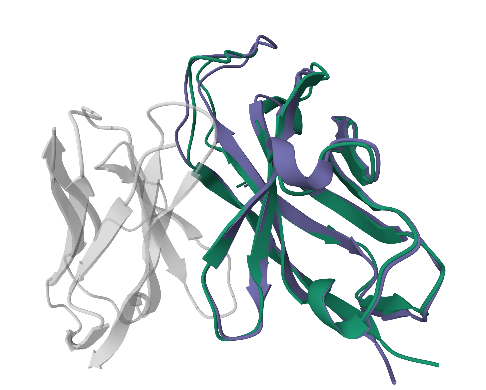
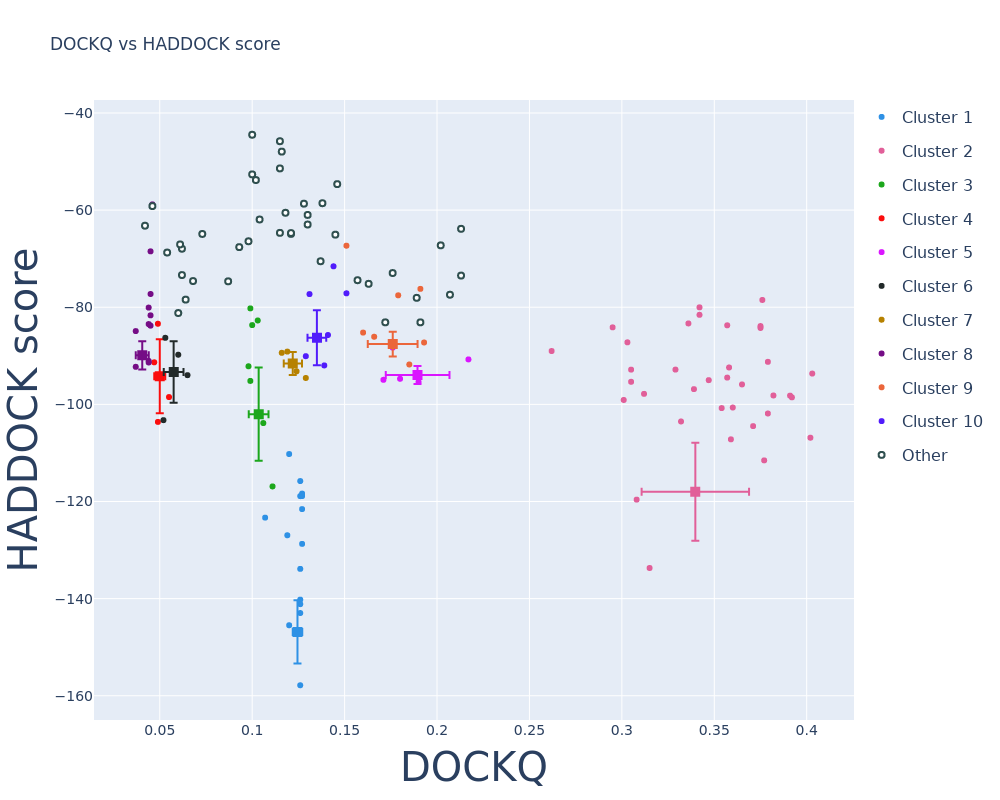

# Improved structural modelling of antibodies and their complexes with clustered diffusion ensembles



This repository contains the input data and scripts related to the following manuscript: 

**M Giulini, X Xu, AMJJ Bonvin**, [*Improved structural modelling of antibodies and their complexes with clustered diffusion ensembles*](https://www.biorxiv.org/content/10.1101/2025.02.24.639865v1.)

All the data files used in the paper are available at [ZENODO](https://zenodo.org/records/14906314). You can download them and place them in the `data` directory.

**Important**: all the scripts available in this repository assume that the numbering of the residues in the PDB files is consistent (meaning there is no overlap in residue numbering, insertions, duplicate side chains, ...), as no checks on that are performed.


## Installation

To install the required packages, you can use the `requirements.txt` file:

```bash
conda create -n afl_clust python=3.10
conda activate afl_clust
pip install -r requirements.txt
```

## cloning RMSD matrix

To be able to cluster the diffusion ensembles, we need to calculate the RMSD matrix. We use the [fast-rmsdmatrix code](https://github.com/mgiulini/fast-rmsdmatrix) to do this.
To clone the code, run the following commands:

```bash
git clone https://github.com/mgiulini/fast-rmsdmatrix.git
cd src/fast-rmsdmatrix/src
make
cd -
```

# Analysing ensembles

To analyse the accuracy of an ensemble, provided the reference structures, you can use the `analyse_diffusion_ensemble.py` script.

For example, to analyse the accuracy of an ensemble of structures coming from colabfold, you can run the following command:

```bash
cd src
python3 analyse_diffusion_ensemble.py ../example/7msq_colabfold ../data/target_files/7msq_targetab_chains.pdb --h1_loop_residues 26:33 --h2_loop_residues 51:57 --h3_loop_residues 96:116 --l1_loop_residues 27:32 --l2_loop_residues 50:52 --l3_loop_residues 89:97
```

where the `--XX_loop_residues` flags are used to specify the residue interval that describe each antibody loop (both amino acids are included). The command will create a file named `ensemble_rmsd_vs_ref.csv` in the directory of the ensemble, containing the RMSD of each structure in the ensemble with respect to the reference.

```bash
head ../example/7msq_colabfold/ensemble_rmsd_vs_ref_full.csv
```

If you want to focus on the heavy chain only, you can remove the light chain loop residues (and change the target file):

```bash
python3 analyse_diffusion_ensemble.py ../example/7msq_colabfold ../data/target_files/7msq_targetab_heavy_chain.pdb  --h1_loop_residues 26:33 --h2_loop_residues 51:57 --h3_loop_residues 96:116
```

Like before, the script will create a file (named `ensemble_rmsd_vs_ref_heavy.csv`) in the directory of the ensemble.

For an an ensemble coming from AlphaFlow, you proceed in the same way:

```bash
python3 analyse_diffusion_ensemble.py ../example/7msq_alphaflow ../data/target_files/7msq_targetab_heavy_chain.pdb  --h1_loop_residues 26:33 --h2_loop_residues 51:57 --h3_loop_residues 96:116
```

# Clustering ensembles

To cluster the ensembles, you can use the same script, but adding the `--cluster` flag:

```bash
python3 analyse_diffusion_ensemble.py ../example/7msq_alphaflow ../data/target_files/7msq_targetab_heavy_chain.pdb  --h1_loop_residues 26:33 --h2_loop_residues 51:57 --h3_loop_residues 96:116 --cluster
```

This will create a file named `cluster_centers_h3_rmsd.csv` in the directory of the ensemble, with all the clustering information, namely

- the number of models considered (`topn`)
- the number of specified clusters (`cl_num`)
- the clustering linkage method used (`cl_method`)
- the name of the center of the cluster (`rmsd`)
- the H3-RMSD of such cluster center (`n_models`)
- mean and standard deviation of the H3-RMSD of the models in the cluster (`mean`, `std`)
- maximum and minimum H3-RMSD of the models in the cluster (`max`, `min`)
- the Shannon entropy of the clustering (`entropy`), constant for given `topn` and `cl_num`. It gives an idea of the distribution of the cluster populations (the lower the entropy, the more skewed the population).

```bash
head ../example/7msq_alphaflow/cluster_centers_h3_rmsd.csv
```

# Generating clustered diffusion ensembles

Once the clustering has been performed, it is straightforward to generate the clustered diffusion ensembles, provided that you have split your best antibody model (for example the top-ranked AlphaFold model) in two chains.

The heavy chain model will be used to fit the diffusion models, which are then merged with the light chain structure (that remains constant).

```bash
python complex_full_antibody.py ../example/7msq_alphaflow/cluster_centers_h3_rmsd.csv ../example/7msq_rank001_heavy.pdb ../example/7msq_rank001_light.pdb  --h1_loop_residues 26:33 --h2_loop_residues 51:57 --h3_loop_residues 96:116 --pdb_code 7msq --topn 50 --cl_num 10
```

This will iterate over the models described in the `cluster_centers_h3_rmsd.csv` file, displaying the RMSD statistics and also the number of backbone clashes between the H3 loop and the light chain model. Typically, models with this type of clashes can be already discarded, as the loop is likely very far from its real orientation. The loop creates a directory named `clustered_alphaflow_ensembles` in the current directory. Within that directory, a new subdirectory is created for given the `pdb_code`, `topn` and `cl_num` values. This directory will contain the following files:

- `ensemble_7msq_top50_cl10.pdb`: the merged heavy and light chain structures combined into an ensemble
- `ensemble_7msq_top50_cl10.csv`: the file with the data associated to each model
- `ensemble_7msq_top50_cl10_noclash.pdb`: ensemble of those PDB files with at most one clash between the H3 loop and the light chain
- `ensemble_7msq_top50_cl10_noclash.csv`: corresponding data file

# Ensemble Refinement and Docking 

## Refinement using the command line

To refine the clustered diffusion ensembles, you can follow this pipeline:
1. install [HADDOCK3](https://github.com/haddocking/haddock3/blob/main/docs/INSTALL.md) and activate the environment. E.g. if installed using conda:
```bash
conda activate haddock3
```
2. generate unambiguous restraints to keep the two chains together. For this you can use your AlphaFold model or one of the models in the ensemble
```bash
cd ../example/7msq_docking
pdb_selmodel -1 ensemble_7msq_top50_cl20_noclash.pdb | pdb_tidy > 7msq_model1.pdb
haddock3-restraints restrain_bodies 7msq_model1.pdb > 7msq_unambig.tbl
```
3. run the refinement using the HADDOCK3 command line interface (now it is using a precalculated unambiguous restraints file but you can easily edit it to use the file you just generated):
```bash
haddock3 emref-alphaflow_ensemble.cfg
```
4. generate a PDB ensemble from the refined structures
```bash
pdb_mkensemble AFL-emref/1_emref/*pdb | pdb_tidy > ensemble_7msq_emref.pdb
```

## Docking using the command line
A tutorial about antibody-antigen docking using the command line version of HADDOCK3 is available [here](https://www.bonvinlab.org/education/HADDOCK3/HADDOCK3-antibody-antigen/). In this case, you can follow these steps provided that you have the antigen structure:

1. extract ambiguous restraints using information about the CDR loops (or about a possible paratope, if available), and about the epitope. As an example, for the 7msq complex, we can use the following commands:
```bash
cd example/7msq_docking
echo 52 53 54 102 103 104 105 106 107 108 109 110 111 159 218 219 > 7msq_antibody.actpass 
echo "" >> 7msq_antibody.actpass
echo 36 41 42 43 44 45 46 47 49 50 51 52 71 72 74 75 81 170 171 175 > 7msq_antigen.actpass
echo "" >> 7msq_antigen.actpass
```

The second and fourth line (the ones with `echo "" >> ...`) are empty lines that are used to specify that no passive residues are defined for the antibody and the antigen, respectively.

2. generate the ambiguous restraints
```bash
haddock3-restraints active_passive_to_ambig 7msq_antibody.actpass 7msq_antigen.actpass > 7msq_ambig_Para_Epi.tbl
```

3. run the docking
```bash
haddock3 docking-alphaflow.cfg
```

This will run the standard HADDOCK pipeline, which requires some time to be completed. For testing purposes, you can always reduce the number of models generated by changing the `sampling` parameter in the `rigidbody` module (inside `docking-alphaflow.cfg`).
```bash
[rigidbody]
# paratope-epitope ambig restraints
ambig_fname = "data/7msq_ambig_Para_Epi.tbl"
# Restraints to keep the antibody chains together
unambig_fname = "data/7msq_unambig_AF2.tbl"
sampling = 50
```

4. inspect the final results by looking at the `7msq-AFL-docking/analysis/` directory, which is created by the HADDOCK3 pipeline. Each `analysis` subdirectory contains a report (`report.html`) that describes the results of the run, together with several plots that summarise the quality of the generated models.



## Refinement using the HADDOCK 2.4 web server

If you don't want to run locally the refinement and docking, you can use the HADDOCK 2.4 web server. To do so, you need to:

1. Go to the [HADDOCK 2.4 web server](https://wenmr.science.uu.nl/haddock2.4/)
2. Select the Refinement option
3. Upload the ensemble file and select the `Energy Minimization Refinement` from the dropdown menu
4. Submit the job
5. generate the ensemble of the refined structures

## Docking using the HADDOCK 2.4 web server

To dock the clustered diffusion ensembles, you can follow [this tutorial on antibody-antigen docking](https://www.bonvinlab.org/education/HADDOCK24/HADDOCK24-antibody-antigen-basic/), being careful to upload the (refined) ensemble file instead of a single structure.
